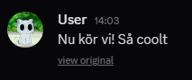
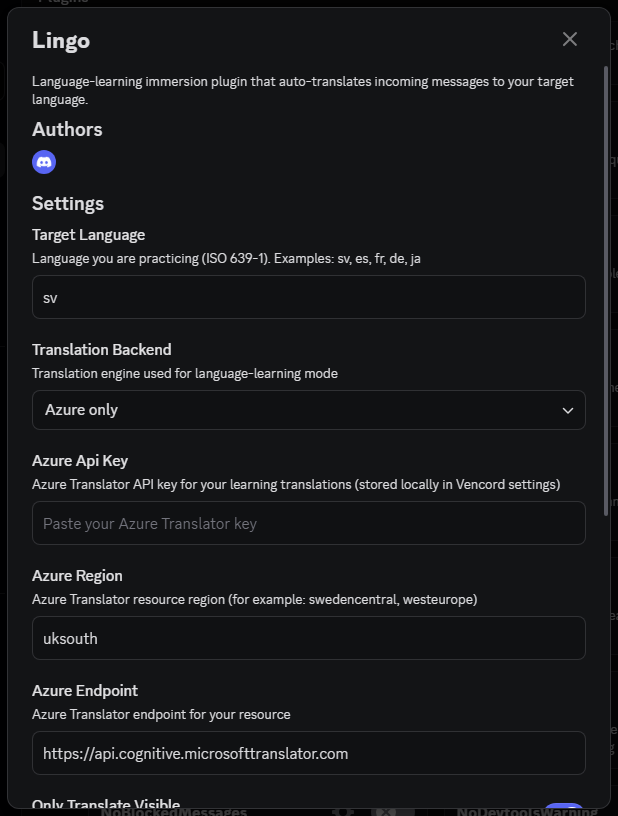

# Lingo

Lingo is a Vencord language-learning plugin that auto-translates incoming messages into your target language, while keeping the original text one click away.

## Why

Reading real conversations in your target language is a fast way to build comprehension.
Lingo removes friction by translating as messages appear, so Discord becomes daily language practice.

## Screenshots

## Quick Start

1. Open your Vencord checkout.
2. Copy this folder into Vencord userplugins:
   - From: `lingo`
   - To: `Vencord/src/userplugins/lingo`
3. Build Vencord:
   - `npm run build`
4. Inject/patch Discord:
   - `npm run inject -- --branch stable`
5. Fully restart Discord.
6. Enable `Lingo` in Vencord settings and set your target language.

## Notes

- `native.ts` is included for Azure Translator support.
- If Azure is unavailable, backend behavior follows your plugin settings (Azure-only or fallback mode).
- Vencord custom plugin docs: `https://docs.vencord.dev/installing/custom-plugins/`
