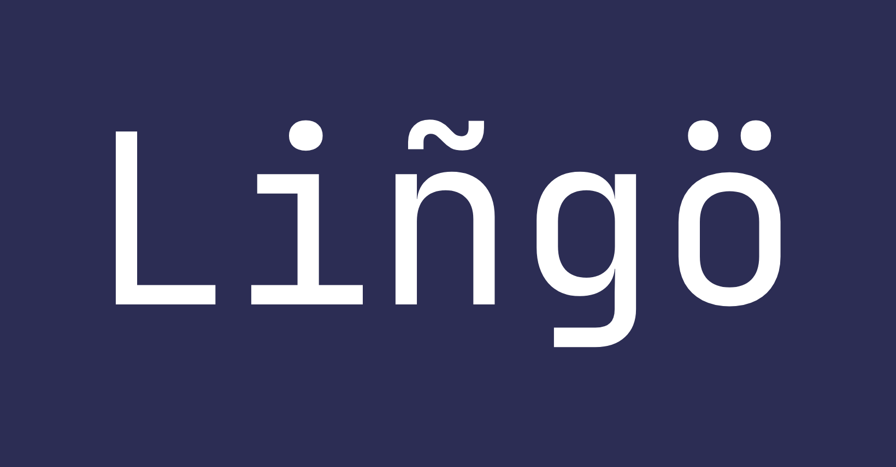

  

<h1 align="center">Lingo</h1>

Language-learning plugin for Vencord with automatic chat translation, with support for 137+ languages.

## Why

Reading real conversations in your target language is a fast way to build comprehension.
Lingo removes friction by translating as messages appear, so Discord becomes daily language practice.

## Features

- Context-aware translations that handle slang and casual phrasing better.
- Multi-language support (137+ languages).
- Translation caching to reduce requests and processing overhead.
- Fallback backend support for better reliability.

## Screenshots

<table align="center">
  <tr>
    <td align="left">
      
    </td>
    <td width="40"></td>
    <td align="right">
      
    </td>
  </tr>
  <tr>
    <td colspan="3" align="center">
      
    </td>
  </tr>
</table>

## Quick Start

1. Open your Vencord checkout.
2. Copy this folder into Vencord userplugins:
   - From: `lingo`
   - To: `Vencord/src/userplugins/lingo`
3. Build Vencord:
   - `npm run build`
4. Inject/patch Discord:
   - `npm run inject -- --branch stable`
5. Fully restart Discord.
6. Enable `Lingo` in Vencord settings and set your target language.

## Friend Release Bundle (Windows, no npm)

1. Build Vencord first:
   - `cd Vencord`
   - `npm run build`
2. Create the shareable zip:
   - `powershell -ExecutionPolicy Bypass -File .\scripts\build-windows-no-npm-release.ps1`
3. Share `release/Lingo-Windows-NoNpm.zip`.

### One-Line Install (Latest Release)

`powershell -NoProfile -ExecutionPolicy Bypass -Command "$u='https://github.com/daisied/lingo/releases/latest/download/Lingo-Windows-NoNpm.zip';$z=Join-Path $env:TEMP 'Lingo-Windows-NoNpm.zip';$d=Join-Path $env:TEMP 'Lingo-Windows-NoNpm';if(Test-Path $d){Remove-Item $d -Recurse -Force};Invoke-WebRequest $u -OutFile $z;Expand-Archive -Path $z -DestinationPath $d -Force;Start-Process -FilePath (Join-Path $d 'install-stable.bat')"`

### Auto Release on Push

Every push to `main` now runs `.github/workflows/release-windows-no-npm.yml`, builds a fresh Windows no-npm bundle, and publishes `Lingo-Windows-NoNpm.zip` to GitHub Releases.

## Notes

- `native.ts` is included for Azure Translator support.
- If Azure is unavailable, backend behavior follows your plugin settings (Azure-only or fallback mode).
- Vencord custom plugin docs: `https://docs.vencord.dev/installing/custom-plugins/`
